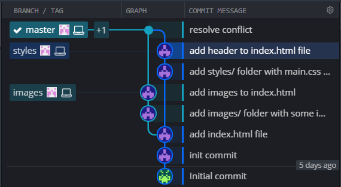
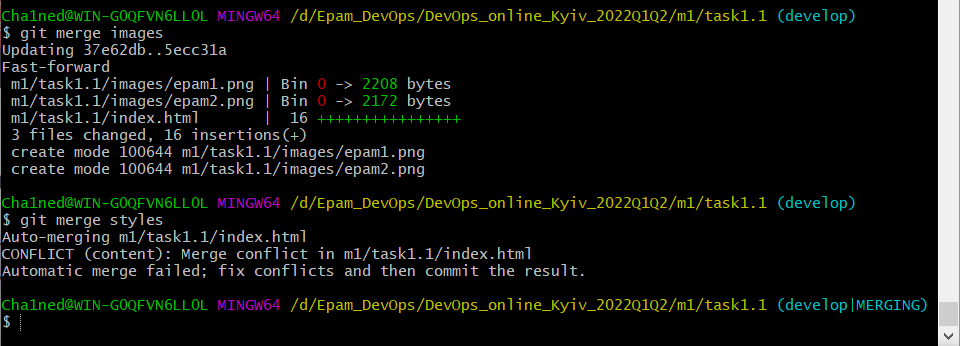
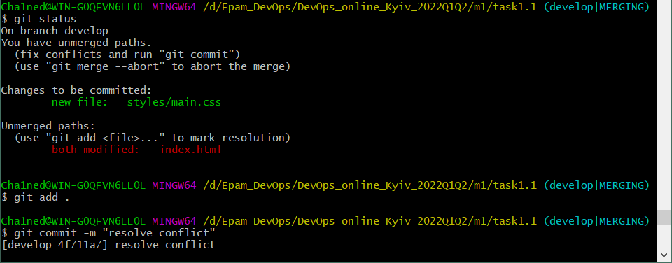
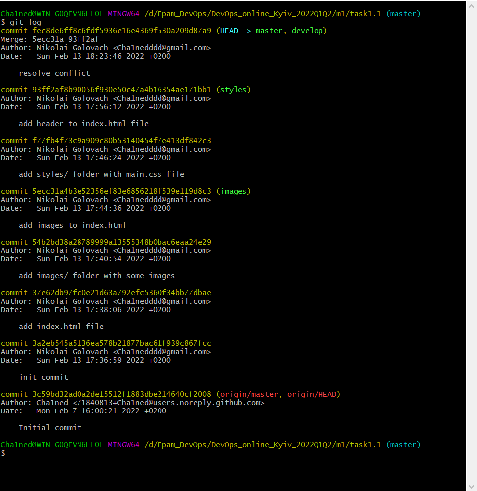
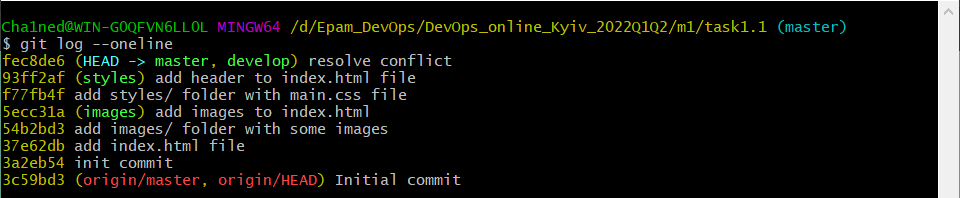

## Task 1.1 Report

- Here's the visualisation of my repository to show that task completed.

- Here's screenshots of resolving merge conflict(Both files edited through VSCode).

- Default *git log* and *git log --oneline* for smoother look

